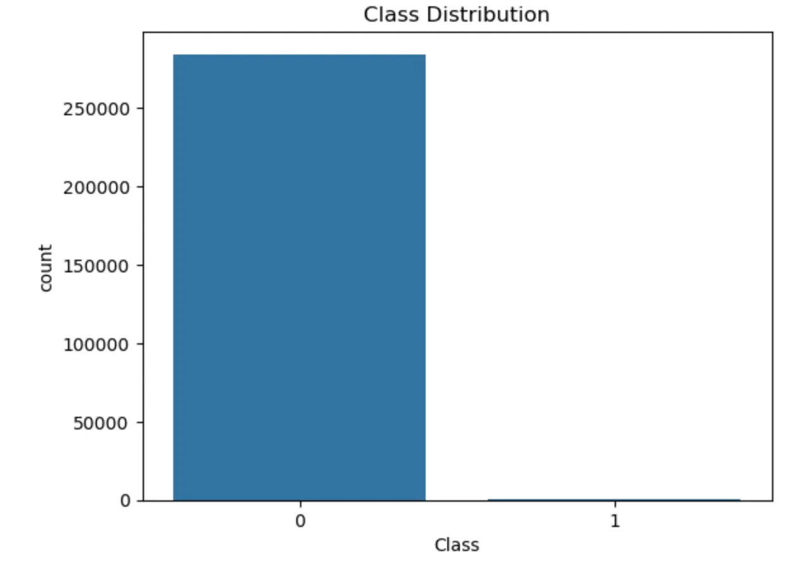
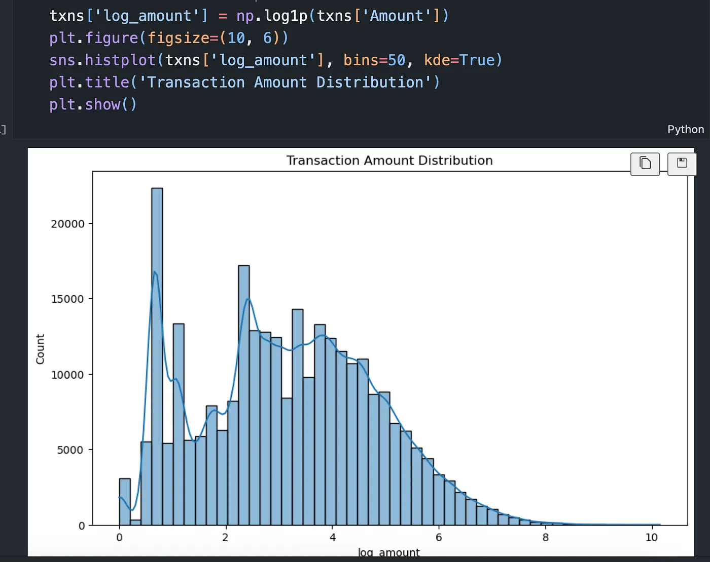

# Credit Card Fraud Detection 🚨💳


# Table of Contents
- [Problem Statement](#problem-statement)
- [Dataset](#dataset)
- [Project Structure](#project-structure)
- [EDA](#exploratory-data-analysis)
- [Modelling](#modelling)
- [Deployment/Containerization](#deploymentcontainerization)
- [API Usage](#api-usage)
- [Coming Soon](#coming-soon)

# Problem Statement
Credit card fraud causes billions of dollars in losses annually. Financial institutions face a critical dilemma: fraudulent transactions represent less than 0.2% of all transactions yet each missed fraud means direct financial losses and eroded customer trust. 

This project implements an end-to-end ML system that predicts credit card fraud probability in real-time, balances precision and recall to minimize both missed fraud and false alarms, and handles extreme class imbalance.

### How It Works
The system operates as a REST API service that integrates into transaction processing pipelines:

```
Transaction → API → XGBoost Model → Fraud Score (0-1) → Decision/Alert
```
Key Use Cases: This system can be used for *real-time* transaction authorization, batch fraud scanning, etc

# Dataset
This project uses the **Credit Card Fraud Detection** dataset from Kaggle, originally collected and analyzed by the *Machine Learning Group*.

**Download:** [Kaggle - Credit Card Fraud Detection](https://www.kaggle.com/datasets/mlg-ulb/creditcardfraud/data) (insert in the `data/` directory after downloading)


#### Dataset Characteristics

| Attribute | Details |
|-----------|---------|
| **Instances** | 284,807 transactions |
| **Features** | 30 numerical features + 1 target variable |
| **Fraud Rate** | 0.172% (492 frauds out of 284,807 transactions) |
| **Class Balance** | Highly imbalanced (fraud : non-fraud = 1:577) |
| **File Size** | ~150 MB (CSV format) |

# Project Structure
```graphql
credit-card/
├── api/
│   └── app.py              # FastAPI app
├── data/
│   ├── creditcard.csv      # Raw dataset (too large to upload, download and insert)
│   └── api_test.csv        # Holdout processed data for API testing
├── models/
│   ├── best_xgb_model.pkl  # Trained XGBoost model
│   └── metadata.json       # Model metadata
├── notebooks/
│   ├── playground.ipynb       # feat engineering + baseline + hyperparam tuning
├── reports/
│   ├── metrics.json          # Evaluation metrics
│   ├── confusion_matrix.png  # Plots from evaluation
│   ├── pr_curve.png          # Plots from evaluation
│   └── roc_curve.png        # Plots from evaluation
├── src/
│   ├── config.py              # store configs
│   ├── data.py                # funcs to load and preprocess data
│   ├── evaluate.py            # extract model metrics + plots
│   ├── logger.py              # logger config
│   ├── predict.py             # funcs for single and batch predictions
│   └── train.py               # training code for xgb model
├── tests/
│   ├── test_data_format.py     # test data format
│   └── test_api.py             # test api responses
├── pyproject.toml       
├── uv.lock                     # virtual environment     
└── README.md
```
# Exploratory Data Analysis
The next step taken was to perform basic exploratory data analysis to check for missing values, view target distribution and perform feature engineering and here are some of the results:


> target variable is very imbalanced (expected) as the the occurence rate of fraud is very low


> log-transformed amount column as it was skewed and the distribution is a bit more normal

- Engineered a few features from the `time` column: *hour_of_day* which contains values from 0 to 23 and *time_of_day* which divides hours into 4 bins (morning, noon, evening, night)

# Modelling
I trained, evaluated and tuned **three** models namely: a `LogisticRegression` model, a `RandomForest` Classifier and an `XGBoost` Classifier


#plot/table showing tuned metrics of the three models


# Deployment/Containerization
The API can be run locally with/without Docker
### Clone repo

```bash
git clone https://github.com/datalordstephen/credit-card.git
cd credit-card
```
## Without Docker

### 1. Create Venv:

* Install UV (fast package manager)
```bash
pip install uv
```

* Create environment and install requirements
```bash
uv init
uv sync
```

### 2 Start up API

```bash
uv run uvicorn api.app:app --reload
```

## With Docker 🐳
Docker provides a containerized environment that ensures consistency across different systems.

### 1. Build the Docker Image
```bash
docker build -t credit-card-fraud-api .
```

### 2. Run the container:
```bash
docker run -p 8000:8000 credit-card-fraud-api
```

### The API will be accessible at http://localhost:8000

#### **Stop the container (after inference)** 
```bash
docker stop fraud-api
```
# API Usage

## Single Prediction:
```bash
python test.py
```

## Batch Prediction:
```python
import requests

# localhost or hostel model
url = "http://127.0.0.1:8000/predict-batch" | "https://cc-fraud-service.onrender.com/predict-batch"
files = {"file": open("data/api_test.csv", "rb")}

response = requests.post(url, files=files)
print(response.json()[:5])  # show first 5 predictions

```

## Results

+ **ROC-AUC ≈ 0.97**
+ **PR-AUC ≈ 0.87**

Balanced precision and recall on fraud cases

> Reports and plots are saved under `reports/`.

## Training (Optional)
If you'd like to train the model before using it: 

* Download the [Credit Card Fraud Detection](https://www.kaggle.com/datasets/mlg-ulb/creditcardfraud/data) on kaggle
* Insert the unzipped file (rename to `creditcard.csv` if it's not named that) into the `data` folder of the project

### Train the model
```bash
uv run python src/train.py
```

### Evaluate the model
```bash
uv run python src/evaluate.py
```

## Features
* Preprocessing
    * Log-transform transaction amounts
    * Time features: hour of day + categorical time buckets
* Modeling
    * XGBoost tuned with `RandomizedSearchCV`
    * Class imbalance handled via `scale_pos_weight`
* Evaluation
    * Metrics: ROC-AUC, PR-AUC, classification report
    * Fraud vs non-fraud probability distribution plots
* API
    * `/predict` → single transaction fraud probability
    * `/predict-batch` → batch predictions from CSV
* Testing
    * Dataset format checks
    * Model + evaluation artifacts
    * API endpoint responses

### 🚀 Coming Soon

+ CI/CD integration with deployment to Render
+ Automated retraining pipeline
+ Streamlit/Gradio dashboard for fraud monitoring
+ Experiments with LightGBM and/or CatBoost